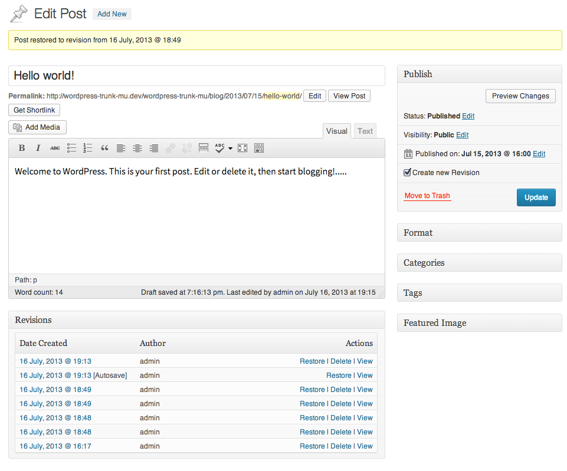

WP Revision Request
===================

About
-----
This lightweight plugin adds three features to WordPress' revision management.

1. Saving revisions on demand: Select wheter you want to save a revision or not.
2. Manually delete a revision.
3. Display revisions right on Your blog. 

### Revision Management

Features
--------
- Save new Revision on demand
- Delete revisions
- Display revision history on the blog
- Plugin-API
- German localization

Compatibility
-------------
- Works in a multisite environment
- WP 3.5.2 through 3.6-RC1-24704

Installation
------------
Move the plugin dir in your `wp-content/` directory and activate it in the GUI.

Hooks/Plugin API
----------
The plugin offers a couple of filters to allow Theme authors to hook in.

Filter `revisioncontroller_actions`:
Use it to add or remove Actions from the revisions metabox.

	// will remove the restore action from Controller Meta Box
	function remove_restore_action( $actions , $post_ID , $revision_ID ) {
		unset($actions['restore']);
		return $actions;
	}
	add_filter( 'revisioncontroller_actions', 'remove_restore_action' , 10 , 3 );

Filter `revision_container_html`:
Use it to change the default container HTML. Make sure you include a `%s`, where the item HTML is merged.

	function gimme_a_div( $html , $post ) {
		return '
%s
';
	}
	add_filter( 'revision_container_html', 'gimme_a_div' , 10 , 2 );

Filter `revision_item_html`:
Use it to change the default item HTML. Make sure you include a `%s`, where the item's link is merged.

	function gimme_a_span( $html , $post , $revision ) {
		return '%s';
	}
	add_filter( 'revision_item_html', 'gimme_a_span' , 10 , 3 );

Roadmap
-------
v 1.0.0
- Test with custom post types
- Translate to german
- Optional Show Revisions on Post.

- Publish on wordpress.org